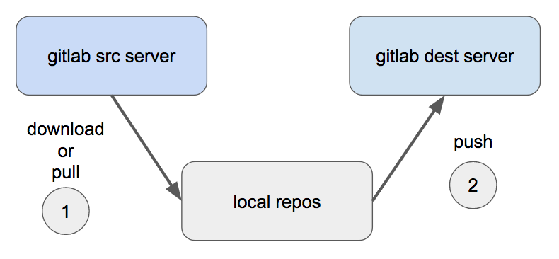

# GitlabMirror

Download all repositories (including all branches) from a gitlab server, then push them to another gitlab server.

## Description

Suppose you have some repositories under `gitlab.example.com:30080/myUserName1`. And you want to copy them to `gitlab.example2.com/myUserName2`. Then this is the right script for you.

## Architecture



## Prerequisites

* git version 1.7.9 and later
* Caching your git account and password by using `git config --global credential.helper cache` command to avoid being repeatedly asked for account and password.
* [jq](https://stedolan.github.io/jq/)
* [curl](https://curl.haxx.se/)
* [Setting personal access tokens in gitlab](https://docs.gitlab.com/ee/user/profile/personal_access_tokens.html)
* linux or macOS operating systems
* Set the tokens for the source and destination gitlab servers. Then run `mv config/git_token_template.sh config/git_token.sh` command.

## Usage

1. Prepare the values in `config/config.sh`. Suppose you have some repositories under `gitlab1.example.com:30080`. And you want to copy them to `gitlab2.example.com`. Then the `config.sh` file in this case is

  ```bash
  #!/bin/bash

  src_gitlab_user_name=myUserName1       # The account to access gitlab1.example.com:30080
  src_gitlab_server_url=gitlab1.example.com
  src_gitlab_port=80

  dest_gitlab_user_name=myUserName2       # The account to access gitlab2.example.com
  dest_gitlab_server_url=gitlab2.example.com
  dest_gitlab_port=30080
  ```

2. Set the tokens in `git_token.sh`. For example,

```bash
#!/bin/bash

git_src_token=abcdefghijklmnopqrst
git_dest_token=qwertyuiopasdfghjklz
```

3. Run `./gitlab_mirror`

4. All the repositories under `gitlab1.example.com:30080` will be copied to `gitlab2.example.com`

## Coding Style

Referenced from [Google Shell Style Guide](https://google.github.io/styleguide/shell.xml)

## License

[MIT](http://opensource.org/licenses/MIT)